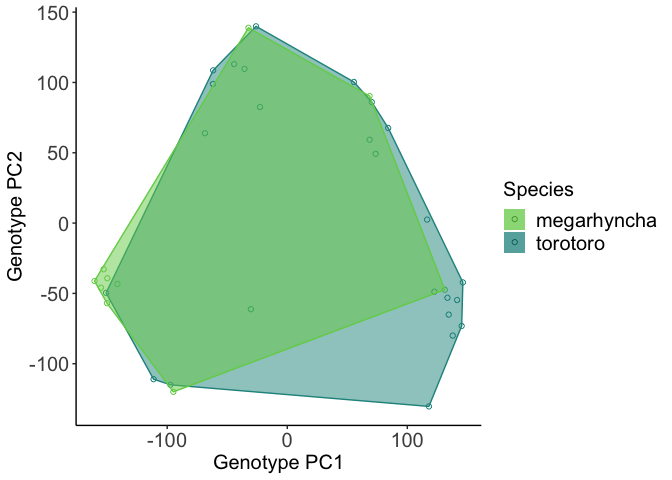

Visualizing genomic data with `ggplot2`
================

## Plotting PCA results from scikit-allel

As I mentioned in the previous tutorial, I loathe Python’s plotting
libraries. So at risk of crossing wires in your brains, we’ll visualize
our anlayses from`scikit-allel` in R, using the extremely powerful
`ggplot2` library from Hadley Wickham et al. We’ll start by installing
this package (if you haven’t already\!) and loading it:

``` r
#install.packages("ggplot2")
#install.packages("magrittr")
#install.packages("dplyr")
library(ggplot2)
library(magrittr)
library(dplyr)
```

    ## 
    ## Attaching package: 'dplyr'

    ## The following objects are masked from 'package:stats':
    ## 
    ##     filter, lag

    ## The following objects are masked from 'package:base':
    ## 
    ##     intersect, setdiff, setequal, union

Next, we’ll read in the .csv file we exported from `scikit-allel`.

``` r
pca.df <- read.csv("~/Dropbox/popgen_analysis_tutorial/pca.csv")
colnames(pca.df) <- c("PC1","PC2")
```

Next, we’ll load some simple sample data, and merge it with the PCA
dataframe:

``` r
sample_data <- read.table("~/Dropbox/popgen_analysis_tutorial/sample_data.txt")
colnames(sample_data) <- c("sample","species")
pca.df <- cbind.data.frame(pca.df, sample_data)
head(pca.df)
```

    ##          PC1       PC2    sample     species
    ## 1  -32.30597 138.87224  EL1_mega megarhyncha
    ## 2  -44.23900 113.01864 EL10_toro    torotoro
    ## 3  -22.67607  82.50533 EL11_toro    torotoro
    ## 4 -150.89993 -49.59729 EL13_toro    torotoro
    ## 5 -149.86020 -39.21653 EL18_mega megarhyncha
    ## 6 -160.55028 -41.18794 EL19_mega megarhyncha

Next, we’ll create a polygon (convex hull) to highlight putative species
ID in PC space:

``` r
hull_tor <- pca.df[pca.df$sp=="torotoro",] %>%
  slice(chull(PC1, PC2))
hull_meg <- pca.df[pca.df$sp=="megarhyncha",] %>%
  slice(chull(PC1, PC2))
```

## Including Plots

``` r
p1 <- ggplot(data=pca.df,aes(x=PC1,y=PC2,fill=species,color=species)) + 
  geom_point(pch=1) +
  scale_fill_manual(values = c("#73D056FF","#20938CFF","#443B84FF"))+
  scale_color_manual(values = c("#73D056FF","#20938CFF","#443B84FF"), guide=FALSE)+
  theme_classic() +
  xlab("Genotype PC1") +
  ylab("Genotype PC2") +
  geom_polygon(data = hull_tor, alpha = 0.5) +
  geom_polygon(data = hull_meg, alpha = 0.5) +
  #geom_polygon(data = hull_ochr, alpha = 0.5) +
  labs(fill="Species") +
  theme(legend.text=element_text(size=15),
        axis.title = element_text(size=15),
        axis.text = element_text(size=15),
        legend.title=element_text(size=15))
```

Lastly, we’ll visualize it:

``` r
p1
```

<!-- -->

So over this portion of the genome, these species are more or less the
same.
